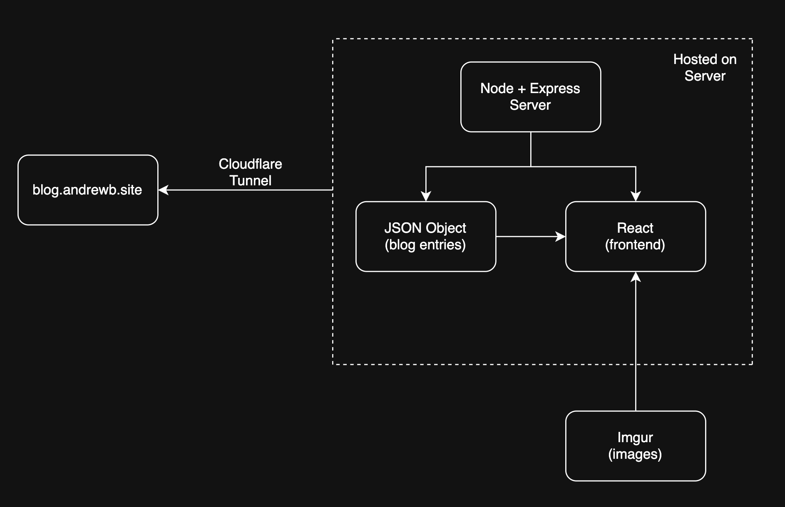

# Blog Tech Stack
The blog is a solo project for exploring ideas.
It is locally hosted on an old laptop using a node server.

This blog uses the following technologies:
React (frontend)
Node (server)
Express (server framework)
Imgur (image hosting)
Local JSON (blog data storage)
GitHub (source control)
Cloudflare Tunnel (connect DNS to server)

